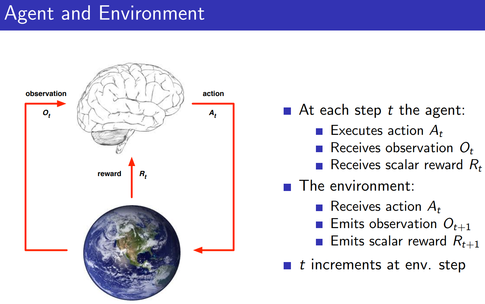

# L1 - Intro to RL

### What makes reinforcement learning different from other machine learning paradigms?
- There is no supervisor, only a reward signal
- Feedback is delayed, not instantaneous
- Time really matters (sequential, non i.i.d data)
- Agent’s actions affect the subsequent data it receives

### What is Reward
- A reward Rt is a scalar feedback signal
- Indicates how well agent is doing at step *t*
- The agent’s job is to maximise cumulative reward
- Reinforcement learning is based on the **reward hypothesis** (All goals can be described by the maximisation of expected cumulative reward)

### Agent and Environment

### History of State
- **History** is the sequence of observations, actions and rewards up to time t
  - Ht = O1, R1, A1, ..., At−1, Ot, Rt
- **State** is the info used to determine what happens next, is a function of history:
  - St = f(Ht)

### Environment State

### Agent State

### Information State
**Information State is Markov State.** The environment state is Markov. The history Ht is Markov.

### Fully Observable Environments
- Agent state (Sat) = environment state (Set) = information state
- Formally, this is a **Markov decision process** (MDP)

### Partially Observable Environments
-  agent state (Sat) != environment state (Set)
-  Formally this is a **partially observable Markov decision process** (POMDP)

### Major Components of an RL Agent
- An RL agent may include **one or more** of these components:
  - Policy: agent’s behaviour function (map from state to action)
    - 
  - Value function: how good is each state and/or action, it is a prediction of future reward
  - Model: agent’s representation of the environment. It predicts what the environment will do next, including state transition matrix and reward.
    - 

### Categorizing RL Agents
- Based on Policy and Value Function
  - 
- Based on Model
  - 
- Overall
  - 

### Learning and Planning
Two fundamental problems in sequential decision making
- Reinforcement Learning:
  - The environment is initially unknown
  - The agent interacts with the environment
  - The agent improves its policy
- Planning:
  - A model of the environment is known
  - The agent performs computations with its model (without any external interaction)
  - The agent improves its policy
  - a.k.a. deliberation, reasoning, introspection, pondering, thought, search

