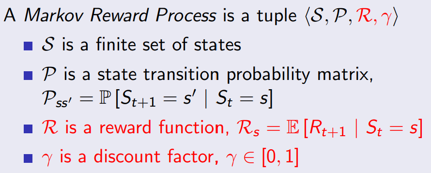

# L1 - Intro to RL

### What makes reinforcement learning different from other machine learning paradigms?
- There is no supervisor, only a reward signal
- Feedback is delayed, not instantaneous
- Time really matters (sequential, non i.i.d data)
- Agent’s actions affect the subsequent data it receives

### What is Reward
- A reward Rt is a scalar feedback signal
- Indicates how well agent is doing at step *t*
- The agent’s job is to maximise cumulative reward
- Reinforcement learning is based on the **reward hypothesis** (All goals can be described by the maximisation of expected cumulative reward)

### Agent and Environment

### History of State
- **History** is the sequence of observations, actions and rewards up to time t
  - Ht = O1, R1, A1, ..., At−1, Ot, Rt
- **State** is the info used to determine what happens next, is a function of history:
  - St = f(Ht)

### Environment State

### Agent State

### Information State
**Information State is Markov State.** The environment state is Markov. The history Ht is Markov.

### Fully Observable Environments
- Agent state (Sat) = environment state (Set) = information state
- Formally, this is a **Markov decision process** (MDP)

### Partially Observable Environments
-  agent state (Sat) != environment state (Set)
-  Formally this is a **partially observable Markov decision process** (POMDP)

### Major Components of an RL Agent
- An RL agent may include **one or more** of these components:
  - Policy: agent’s behaviour function (map from state to action)
    - 
  - Value function: how good is each state and/or action, it is a prediction of future reward
  - Model: agent’s representation of the environment. It predicts what the environment will do next, including state transition matrix and reward.
    - 

### Categorizing RL Agents
- Based on Policy and Value Function
  - 
- Based on Model
  - 
- Overall
  - 

### Learning and Planning
Two fundamental problems in sequential decision making
- Reinforcement Learning:
  - The environment is initially unknown
  - The agent interacts with the environment
  - The agent improves its policy
- Planning:
  - A model of the environment is known
  - The agent performs computations with its model (without any external interaction)
  - The agent improves its policy
  - a.k.a. deliberation, reasoning, introspection, pondering, thought, search

- Example: RL
  - 
- Example: Planning
  - 

### Exploration and Exploitation
- Exploration finds more information about the environment
- Exploitation exploits known information to maximise reward
- It is usually important to explore as well as exploit

### Prediction and Control in Learning
- Prediction: evaluate the future
  - Given a policy, find the value function
- Control: optimise the future
  - Find the best policy
  - What is the optimal value function over all possible policies?
  - What is the optimal policy?

# L2 - Markov Decision Processes

Markov decision processes formally describe an *fully observable* environment for reinforcement learning.

Almost all RL problems can be formalised as MDPs, e.g.
- Optimal control primarily deals with continuous MDPs
- Partially observable problems can be converted into MDPs
- Bandits are MDPs with one state

### Markov Property
The future is independent of the past given the present
- 

### State Transition Matrix
- 

### Markov Process
A Markov process is a **memoryless random process**, i.e. a sequence of random states S1, S2, ... with the Markov property.
- 

### Markov Reward Process
A Markov reward process is a Markov chain with values.
- 

### Return

### Why discount?
- Mathematically convenient to discount rewards
- Avoids infinite returns in cyclic Markov processes
- Uncertainty about the future may not be fully represented
- If the reward is financial, immediate rewards may earn more interest than delayed rewards
- Animal/human behaviour shows preference for immediate reward
- It is sometimes possible to use undiscounted Markov reward processes (i.e. γ = 1), e.g. if all sequences terminate

### Value Function
- The state value function v(s) of an MRP is the expected return starting from state s
- **v(s) = E [Gt | St = s]**

### Bellman Equation for MRPs

- Bellman Equation in Matrix Form
- 

- The Bellman equation is a linear equation and can be solved directly.
- Computational complexity is O(n3) for n states
- Direct solution only possible for small MRPs
- There are many iterative methods for large MRPs, e.g.
  - Dynamic programming
  - Monte-Carlo evaluation
  - Temporal-Difference learning

### Markov Decision Process
- A Markov decision process (MDP) is a Markov reward process with decisions (action).
- 

- Summary:
  - Markov Process (MP): {S, P}
  - Markov Reward Process (MRP): {S, P, R, γ}
  - Markov Decision Process (MDP): {S, A, P, R, γ}, **policy decide with action to take, after that, model (P) decides what the next state is**

### Policies
- A policy π is a distribution over actions given states,
- **π(a|s) = P[At = a | St = s]**
- MDP policies depend on the current state (not the history)
- Policies are stationary (time-independent)
- Given an MDP M = (S, A, P, R, γ) and a policy π
- The state sequence S1, S2, ... is a Markov process (S,Pπ)
- The state and reward sequence S1, R2, S2, ... is a Markov reward process (S,Pπ,Rπ,γ)
  - 

#### Policy State Value Function
- **vπ(s) = Eπ[Gt|St = s]**
- **vπ(s) = Eπ[Rt+1 + γvπ(St+1) | St = s]**
- 
- 
- **vπ = Rπ + γPπvπ**

#### Policy Action Value Function
- **qπ(s,a) = Eπ[Gt|St = s, At = a]**
- **qπ(s,a) = Eπ[Rt+1 + γqπ(St+1,At+1) | St = s, At = a]**
- 
- 

#### Optimal Value Function

#### Optimal Policy

#### Bellman Optimality Equation for V* and Q*

#### Solving the Bellman Optimality Equation

### Partially observable MDPs (POMDPs)

# L3 - Planning by Dynamic Programming

### What is Dynamic Programming?
- **Dynamic** sequential or temporal component to the problem
- **Programming** optimising a “program”, i.e. a policy
- A method for solving complex problems
- By breaking them down into subproblems
  - Solve the subproblems
  - Combine solutions to subproblems
 
### Requirements for Dynamic Programming
- Dynamic Programming is a very general solution method for problems which have two properties:
- Optimal substructure
  - Principle of optimality applies
  - Optimal solution can be decomposed into subproblems
- Overlapping subproblems
  - Subproblems recur many times
  - Solutions can be cached and reused
- Markov decision processes satisfy both properties
  - Bellman equation gives recursive decomposition
  - Value function stores and reuses solutions

### Planning by Dynamic Programming
- 

### Other Applications of Dynamic Programming
- 

### Iterative Policy Evaluation
- 
- 

### How to Improve a Policy
- 
- This process of **policy iteration** always converges to π∗

### Modified Policy Iteration
- No need to wait for policy evaluation to converge to vπ
- Can update policy every iteration (equivalent to value iteration)

### Generalised Policy Iteration
- 

### Principle of Optimality
- 

### Deterministic Value Iteration
- 

### Value Iteration
- Unlike policy iteration, there is no explicit policy
- Intermediate value functions may not correspond to any policy
- Use **Bellman optimality backup** for each iteration (policy iteration use Bellman Expectation backup)
- The rest is the same as policy iteration
- 
- 

